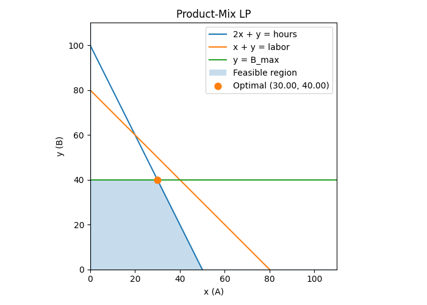

# Pyomo Linear Programming Example — Product Mix

This is a minimal, self-contained **linear program (LP)** using [Pyomo](https://www.pyomo.org/) to decide how many units of two products (A and B) to produce in order to **maximize profit** subject to **machine-hour, labor-hour, and demand** constraints.

<p align="center">
  
</p>


---

## Problem formulation

$$
\begin{array}{ll}
\textbf{Maximize} & z = 40x_A + 30x_B \\[0.4em]
\textbf{Subject to} &
\left\{
\begin{array}{l}
  2x_A + x_B \le 100 \\
  x_A + x_B \le 80 \\
  x_B \le 40 \\
  x_A,\; x_B \ge 0
\end{array}
\right.
\end{array}
$$


---

## Quick start

### 1) Install Python packages
```bash
uv add pyomo matplotlib
```

You’ll also need a **solver** (GLPK or CBC):

- macOS:  
  ```bash
  brew install glpk
  ```
- Ubuntu/Debian:  
  ```bash
  sudo apt install glpk-utils
  ```
- Windows:  
  Download GLPK binaries or install CBC from [CoinOR](https://github.com/coin-or/Cbc).

---

### 2) Run the solver
```bash
uv run python main.py
```

Example with custom limits:
```bash
uv run python main.py --hours 120 --labor 90 --bmax 50
```

---

### 3) Run with plot
To **visualize** the constraints, feasible region, and optimum:
```bash
uv run python main.py --plot
```

Example with custom limits and plot:
```bash
uv run python main.py --hours 120 --labor 90 --bmax 50 --plot
```

---

### 4) Saving the plot to `docs/`
When using `--plot`, the program will automatically save the diagram as:
```
docs/fig.png
```
…while also showing it interactively. You can change the filename/location in `plot.py`.

---

## Example Output (CLI)
```
Solver: glpk
Status: ok | optimal

Optimal production plan:
  A: 30.00 units
  B: 40.00 units

Total profit: 2200.00

Resource usage at optimum:
  Machine hours: 100.00 / 100
  Labor hours:   70.00 / 80
  B upper bound: 40.00 / 40
```